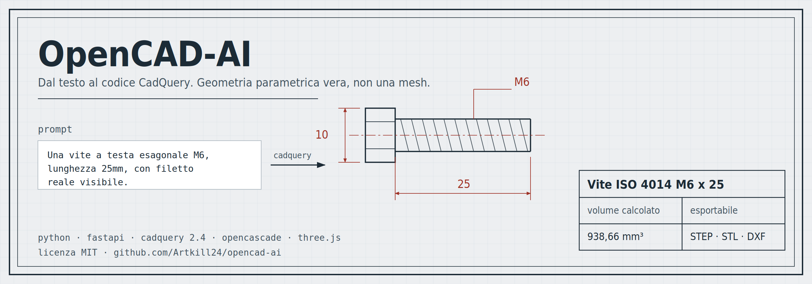
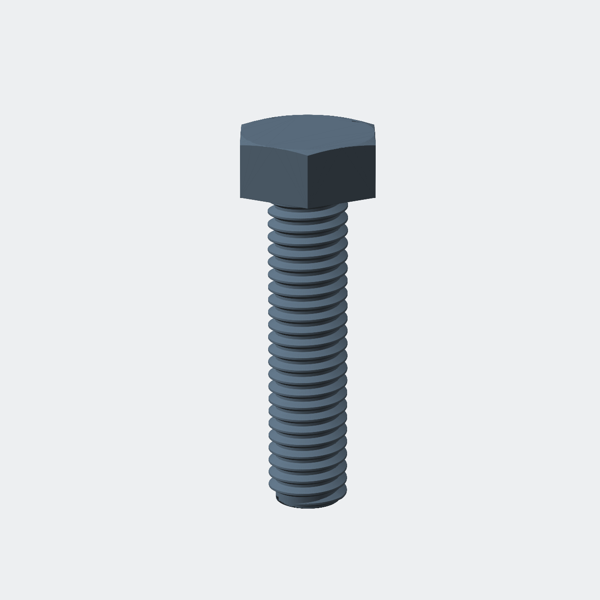
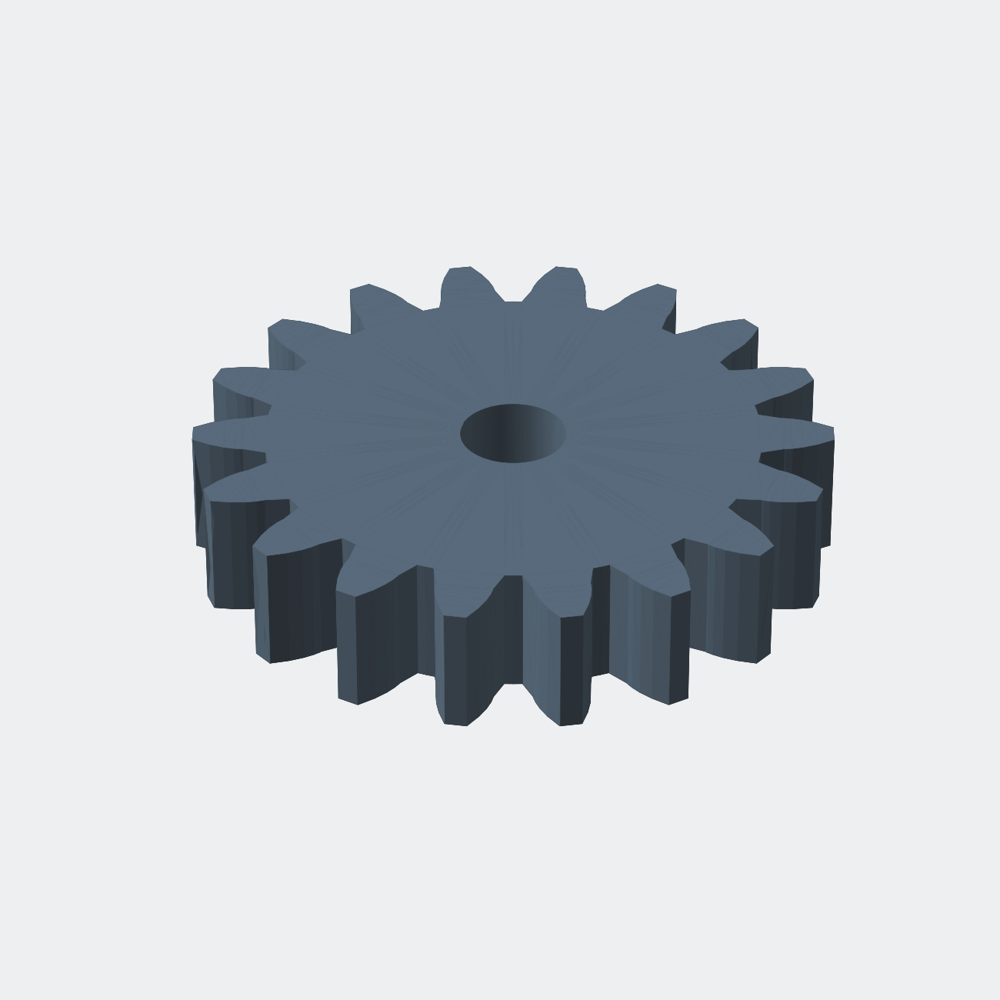
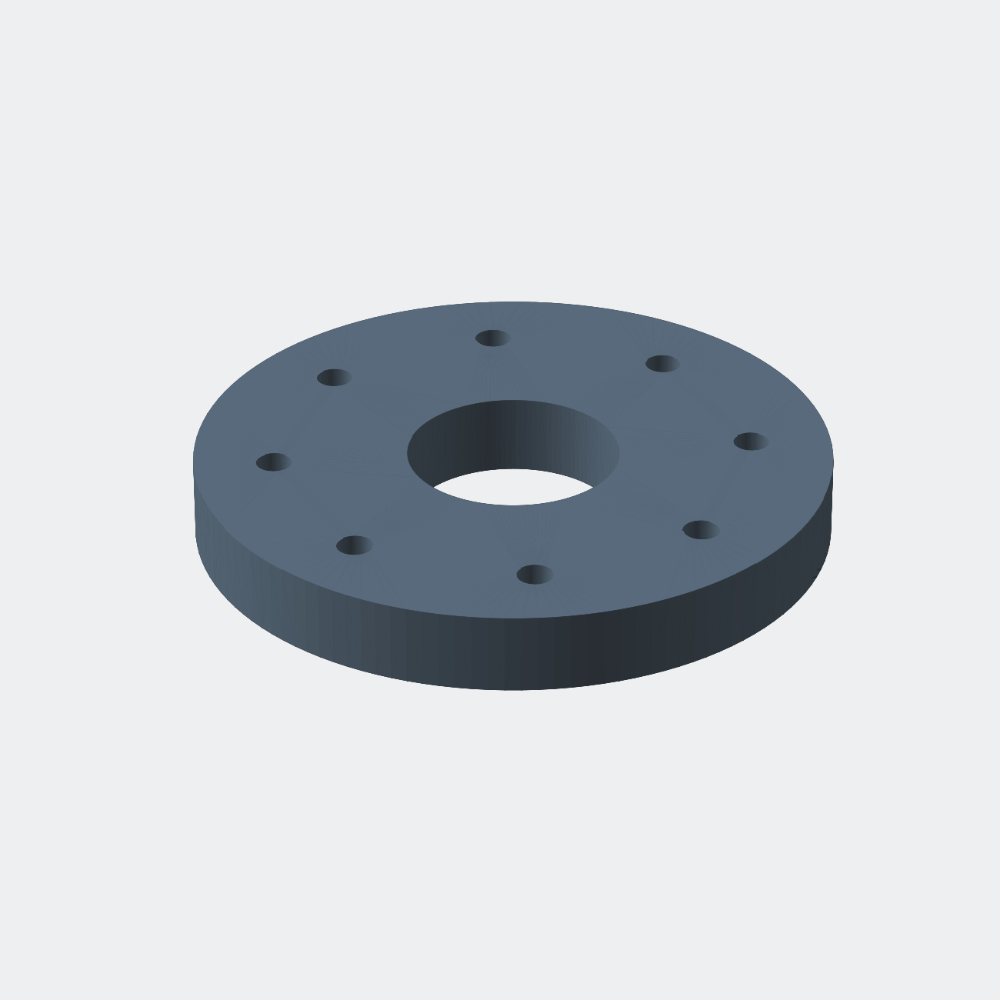
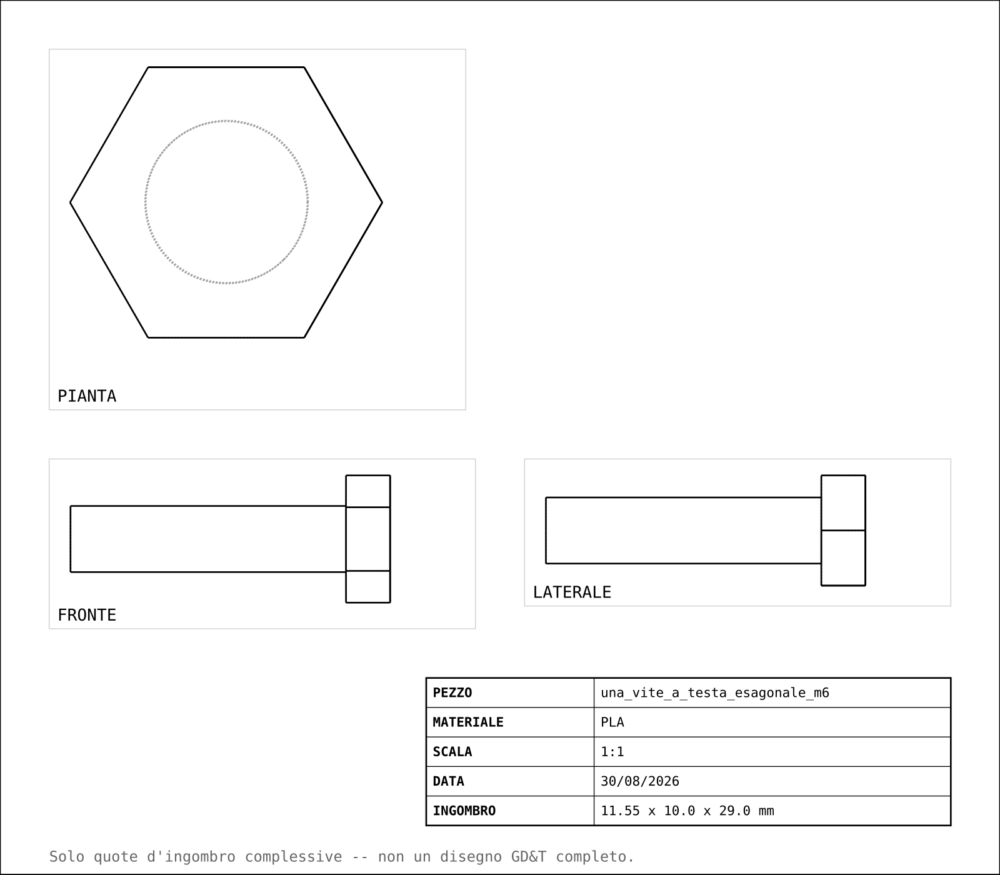

<p align="center">
  
</p>

<p align="center">
  
  
  
  
  <a href="https://github.com/Artkill24/opencad-ai/stargazers"></a>
</p>

Genera modelli CAD 3D parametrici a partire da un prompt testuale in linguaggio naturale, da una foto, o da un disegno tecnico quotato. Il testo diventa codice [CadQuery](https://github.com/CadQuery/cadquery) reale (non una mesh approssimata), eseguito su [OpenCASCADE](https://dev.opencascade.org/), esportabile in STEP/STL/GLB/DXF con un visualizzatore 3D nel browser.

Stack: Python/FastAPI, CadQuery 2.4, Gemini + Groq (con instradamento deterministico per parti standard), Three.js.

## Cosa produce

<p align="center">
  
</p>

| Prompt | Modello generato | Verifica |
|---|---|---|
| *Una vite a testa esagonale M6, lunghezza 25mm, con filetto reale* |  | volume 938,66 mm³ — corrisponde al calcolo indipendente |
| *Un ingranaggio a denti dritti, modulo 3, 18 denti* |  | profilo a evolvente verificato contro le formule ISO |
| *Una flangia circolare diametro 120mm* |  | quote esatte, non approssimate da una mesh |

Ogni modello è **codice CadQuery editabile**, non una mesh: puoi cambiare un parametro e rigenerare il pezzo, o aprire lo STEP in Fusion, FreeCAD o SolidWorks.

### Disegno tecnico ed export

<p align="center">
  
</p>

Lo stesso modello esce come STEP per il CAD, STL per la stampa 3D, GLB per il web (55-65% più leggero di STL, verificato), DXF per taglio laser/CNC, e disegno 2D a 3 viste con cartiglio.

## Perché un altro tool di "AI + CAD"

La maggior parte degli approcci text-to-3D produce mesh dense o nuvole di punti — belle da vedere, inutilizzabili per la produzione reale (nessuna misura esatta, nessuna feature modificabile). OpenCAD-AI genera invece **codice parametrico vero**: un foro è un foro con un diametro preciso, non un buco approssimato in una mesh.

Il principio guida di tutto il progetto: **verificare ogni funzionalità con un numero concreto prima di fidarsene**, e **preferire un controllo deterministico a sperare che il modello si comporti bene**, ogni volta che è possibile.

## Funzionalità (tutte verificate con numeri concreti, non solo "sembra funzionare")

- **Generazione da prompt testuale** con ciclo di auto-repair (l'errore di esecuzione viene rimandato al modello per la correzione)
- **Percorso deterministico per parti standard** (viti, dadi, rondelle, cuscinetti): estrae i parametri dal prompt e chiama direttamente funzioni verificate, **senza mai passare dal modello** — zero rischio di aggiramento o dimensioni sbagliate
- **Libreria di esempi verificati con recupero dinamico**: ogni generazione riuscita arricchisce un pool che guida (senza sostituirlo) il system prompt per richieste future strutturalmente simili
- **Rilevatore AST di bug geometrici noti** (es. `.union()` + `.hole()` con `.center()` in mezzo, `.shell()` con `ruled=True` su un loft — quest'ultimo corretto automaticamente prima dell'esecuzione)
- **DFM per processo di stampa** (FDM/Resina/SLS): sbalzi a rischio, spessore minimo pareti, peso/costo stimato
- **Solidi platonici, ingranaggi a evolvente reali** (verificati contro formule ISO), **parti ISO standard** (dadi/viti/rondelle/cuscinetti via `cq_warehouse`, incluse filettature elicoidali reali)
- **Riconoscimento di disegni tecnici quotati** (visione): separa le quote certe da quelle incerte, non allucina numeri
- **Sistema di assemblaggio multi-parte** (posizionamento manuale, nessun risolutore automatico di vincoli — dichiarato, non nascosto)
- **Export**: STEP, STL, GLB (55-65% più leggero di STL, verificato), DXF (profilo piatto per taglio laser/CNC), disegno tecnico 2D a 3 viste con cartiglio
- **Due motori AI intercambiabili** (Gemini, Groq) più una modalità ibrida (Gemini per il primo tentativo, Groq per le correzioni veloci)

## Avvio rapido

```bash
git clone https://github.com/Artkill24/opencad-ai.git
cd opencad-ai
cp .env.example .env   # inserisci le tue chiavi API
docker build -t opencad-backend .
docker run -p 8000:8000 --env-file .env -v $(pwd)/outputs:/app/outputs opencad-backend
```

Apri `http://localhost:8000`. Serve almeno una chiave `GEMINI_API_KEY` ([console Google AI](https://aistudio.google.com/)); `GROQ_API_KEY` è opzionale ([console Groq](https://console.groq.com/)).

## Cosa NON fa (ancora) — onestà come principio, non come formalità

- **Nessuna FEA vera**: l'infrastruttura di base (CalculiX + Gmsh) è verificata funzionante nel container, ma manca il generatore del file `.inp` da mesh 3D — chi volesse contribuire, è probabilmente il pezzo di lavoro singolo più prezioso rimasto aperto
- **Nessuna quotatura automatica nel DXF**: solo il profilo geometrico, senza quote vere e proprie
- `cq_warehouse` (usata per dadi/viti/rondelle/cuscinetti) non è aggiornata dal 2023 — funzionante ma con un bug noto e documentato (volume raddoppiato nelle rondelle, aggirato costruendo la geometria internamente)
- **Contenitori cavi su profili molto rastremati** possono risultare sigillati invece che cavi (limite noto di `.shell()` su certe geometrie da loft)
- **Nessun DFM per lavorazione CNC o lamiera** (solo stampa 3D)

## Contribuire

Vedi [CONTRIBUTING.md](CONTRIBUTING.md). Le aree con più bisogno di aiuto sono elencate sopra in "Cosa NON fa (ancora)".

Il modo più utile per segnalare un problema è **un caso concreto in cui la geometria generata è sbagliata**: prompt esatto, codice prodotto, e il calcolo indipendente che dimostra l'errore — lo stesso standard di verifica usato in tutto il progetto.

## Licenza

MIT — vedi [LICENSE](LICENSE).

---

Costruito da [Saad Kaicar](https://www.linkedin.com/in/saad-k-95a26430b/) tra un turno e l'altro — newsletter *Shipping Between Shifts*.
